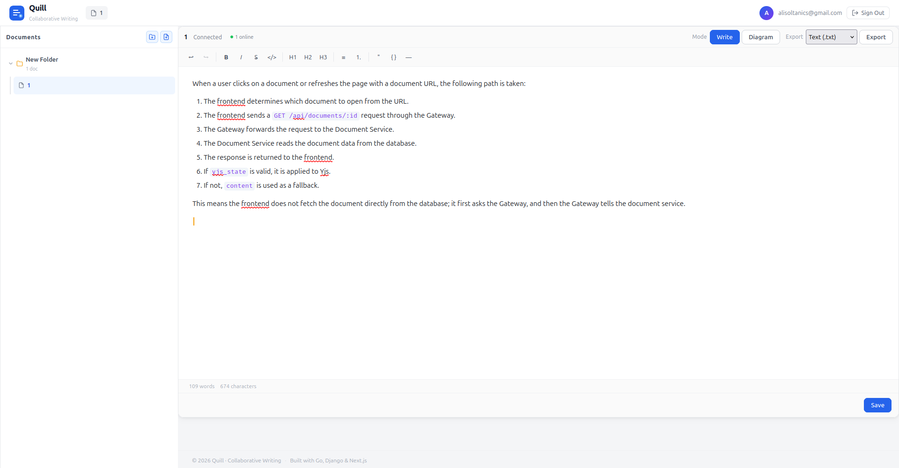

<p align="center">
  
</p>

<h1 align="center">Quill</h1>

<p align="center">
  <em>Real-time Collaborative Document System</em>
</p>

<p align="center">
  <a href="docs/system-implementation-guide.md">English Guide</a> •
  <a href="docs/system-implementation-guide-fa.md">راهنمای فارسی</a>
</p>

---

> [!NOTE]
> **This project is under active development.** New features are being added regularly to practice and explore system design, microservices architecture, real-time collaboration patterns, AI integration, and more. Stay tuned for updates.

---

## Architecture Guide

| | Document |
|---|---|
| **[English](docs/system-implementation-guide.md)** | Full architecture guide in English |
| **[فارسی](docs/system-implementation-guide-fa.md)** | راهنمای معماری به فارسی |

---

## Services

| Service | Stack | Port | Description |
|---------|-------|------|-------------|
| `frontend` | Next.js, TipTap, Yjs | 3000 | Collaborative editor UI |
| `gateway` | Go, gorilla/websocket | 8080 | WebSocket connections, JWT auth, Redis pub/sub |
| `document-service` | Django, DRF, Yjs | 8000 | Document CRUD, CRDT merge, persistence |
| `auth-service` | Django, DRF | 8002 | JWT auth (register, login, refresh) |
| `audit-service` | Django, DRF | 8003 | Activity logging, Kafka consumer |
| `export-service` | Django, DRF | 8001 | PDF/HTML/Markdown export |

## Run

```bash
docker compose up -d
```

## Stop

```bash
docker compose down
```

Remove volumes too:

```bash
docker compose down -v
```

## Hot-Reload

These services mount host source — no rebuild needed:

- `frontend`
- `document-service`
- `export-service`
- `auth-service`
- `audit-service`

`gateway` requires rebuild (Go binary). For live Go dev:

```bash
cd services/gateway
go run .
```

## URLs

| Service | URL |
|---------|-----|
| Frontend | `http://localhost:3000` |
| Gateway | `http://localhost:8080` |
| Document Service | `http://localhost:8000` |
| Export Service | `http://localhost:8001` |
| Auth Service | `http://localhost:8002` |
| Audit Service | `http://localhost:8003` |

## Docs

- [Dev Setup](docs/dev-setup-and-run.md)
- [Architecture Guide (English)](docs/system-implementation-guide.md)
- [Architecture Guide (فارسی)](docs/system-implementation-guide-fa.md)
